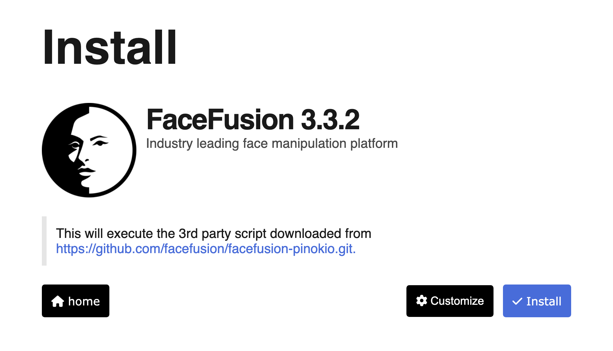

# Pinokio

Launch Anything.

# Script Policy

Pinokio is a 1-click launcher for any open-source project. Think of it as a terminal application with a user-friendly interface that can programmatically interact with scripts.

This means:

1. **Scripts can run anything:** Just like terminal apps can run shell scripts, Pinokio scripts can run any command, download files, and execute them. Essentially, Pinokio is a user-friendly terminal with a UI.
2. **How scripts can be run:** There are two ways to run scripts on Pinokio:
    1. **Write your own:** Just like writing and executing shell scripts in the terminal, you can create your own scripts and run them locally.
    2. **Install from the "Discover" page:** Vetted scripts are manually listed in the directory, tracked via Git, and frozen under the official GitHub organization. These are guaranteed to be secure and safe to install.
3. **Verified Scripts:** To be featured on the "Discover" page, scripts must go through the following strict process:
    1. **Publisher Verification:** You must be personally verified to submit scripts for consideration. Contact the Pinokio admin (https://x.com/cocktailpeanut) to request verification.
    2. **Github Organization Invitation:** Once verified, you'll be invited to the official Pinokio Factory GitHub organization as a contributor. Only members of this organization can publish scripts eligible for the "Discover" page. Abusing publishing privileges may result in removal from the organization.
    3. **Repository Transfer and Freeze** To apply for a feature, you must transfer your script repository to the Pinokio Factory GitHub organization. Follow this guide: https://docs.github.com/en/repositories/creating-and-managing-repositories/transferring-a-repository
    4. **Feature Application:** Once your repository is fully transferred and controlled by the organization, it is considered "frozen". You can then request to feature it on the "Discover" page by contacting the admin.
    5. **Review:** The script will be thoroughly reviewed and tested by the Pinokio admin. If verified as safe, it will be featured on the "Discover" page.
    6. **Troubleshooting:** If any issues arise after a script is featured, the Pinokio admin may:
        - Delist the script from the "Discover" page
        - Modify the script to resolve the issue. Since the script is under the Pinokio Factory organization, the admin has the rights to make necessary fixes.

# Security

## Scripts are isolated by design

By default all Pinokio scripts are stored run under an isolated location (at `~/pinokio/api`). Additionally, all binaries installed through the built-in package managers in Pinokio are installed within `~/pinokio/bin`. Basically, everything you do is stored inside `~/pinokio`. The risk factor is when a script intentionally tries to deviatte away from this.

The script verification process checks to make sure this doesn't happen.

Th Pinokio script syntax was designed to make this process simpler, both by human and machines.

## Scripts are open source

All scripts must be downloaded from public git repositories. The scripts are both human readable and machine readable (written in JSON syntax), so you can always check the source code before running it.

Here's an example install screen, with an alert letting you know the downloaded 3rd party script is about to be run, as well as the URL to the original script repository where it was downloaded from.



## Script Verification

Verified scripts are scripts that are explicitly reviewed and approved by the Pinokio admin. Because the scripts are designed to run isolated by default, and the syntax makes it easy to detect when a command intentionally tries to run things outside of the isolated environment, it is easy to detect any script that does things out of the ordinary. Here are some of the checks done by the Pinokio admin to make sure each script file is secure:

1. **Path check:** When we verify the scripts, we look at the scripts to see if all commands are run inside each app's path. The script syntax was designed to make this process easy (with the `path` attribute, which declares the folder path from which to run a command, and by default the execution path is each app's path)
2. **Venv check:** We also check to make sure every dependency installation is done within the context of each app using `venv`. This process is again made easy with the script syntax (with the `venv` attribute, which automatically activates a virtual environment and installs all dependencies there, inside each app's folder)
3. **3rd Party Package check:** We also check that any 3rd party packages installed through Pinokio to make sure that they are installed inside the pinokio isolated environment. The built-in package mangagers (Conda, Homebrew, Pip, and NPM) install everything inside the isolated pinokio home path (`~/pinokio`) by default. Since everything runs isolated by default, verifying this is simple (by checking that there are no explicit declaration of additional code that tries to go outside of the isolated environment)

Here's an example execution script that installs python dependencies:

```json
{
  "method": "shell.run",
  "params": {
    "message": "uv pip install -r requirements.txt",
    "path": "server",
    "venv": "venv"
  }
}
```

1. First of all, by default the entire thing is run isolated in the pinokio activated conda environment, and the execution path is the downloaded app's path (for example `~/pinokio/api/myapp`)
2. second, since the `path` is declared as `server`, the code will be run inside the `server` folder ofr the app (in this case `~/pinokio/api/myapp/server`)
3. Third, the `venv` attribute  is included, so the python dependencies are also installed in an app-isolated manner. If the app is located at `~/pinokio/api/myapp`, the The depenencies will be stored at `~/pinokio/api/myapp/venv`

The script verification check makes sure that all these components are run locally within the constraints of each app.

Of course, there are also additional checks such as:

1. Checking the reputation of the repository and the developer of the original project
2. Trhing out the app personally
3. Making sure that the install and launch instructions actually follow the recommended instructions suggested in the original project's README.

No scripts are approved until rigorously tested.
